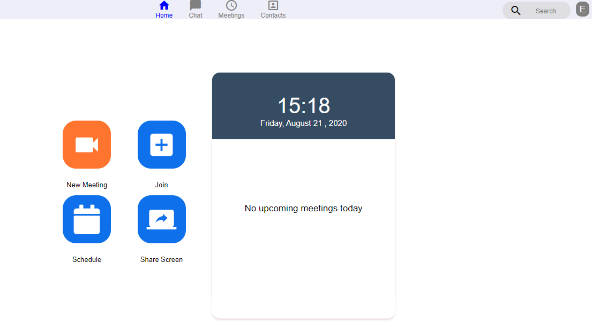
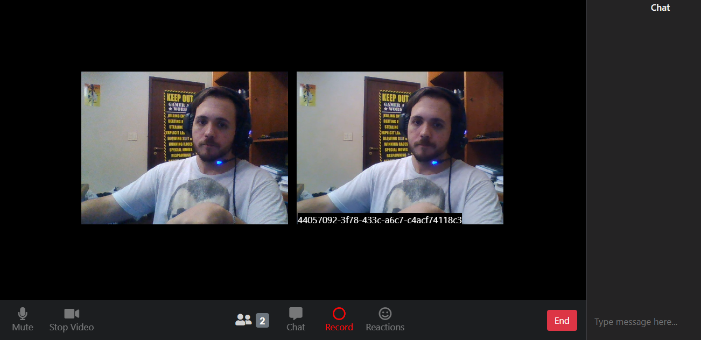

# ZoomClone

<p align="center">
  <a href="https://github.com/capelaum/ZoomClone/stargazers">
    
  </a>
  
  
  
  
	
  <a href="https://github.com/capelaum/ZoomClone/commits/master">
    
  </a>
  
  <a href="https://www.linkedin.com/in/luis-capelletto/">
    
  </a>
</p>

<p align="center">
  <a href="#aplica%C3%A7%C3%A3o-de-cadastro-de-pontos-de-coleta">Projeto</a>&nbsp;&nbsp;&nbsp;|&nbsp;&nbsp;&nbsp;
  <a href="#tecnologias">Tecnologias</a>&nbsp;&nbsp;&nbsp;|&nbsp;&nbsp;&nbsp; 
  <a href="#layout">Layout</a>&nbsp;&nbsp;&nbsp;|&nbsp;&nbsp;&nbsp; 
  <a href="#como-executar">Como executar</a>&nbsp;&nbsp;&nbsp;|&nbsp;&nbsp;&nbsp;
  <a href="#como-contribuir">Como contribuir</a>&nbsp;&nbsp;&nbsp;|&nbsp;&nbsp;&nbsp; 
  <a href="#memo-licen%C3%A7a">Licença</a>&nbsp;&nbsp;&nbsp;|&nbsp;&nbsp;&nbsp;
  <a href="#créditos">Créditos</a> 
</p>

## Funcionalidades

Projeto inspirado no software do [Zoom](https://zoom.us/pt-pt/freesignup.html) que cria uma simulação de sala de video conferência, utilizando a câmera e audio disponiveis do dispositivo através do navegador.

Possui a opção de varias pessoas na mesma sala, bastando duplicar a guia do navegador. Pode  gravar a chamada de multiplos usuários, apertando o botão de record no menu, ainda fazendo o download das gravações ao sair da sala.

- Acesse o [home](./pages/home/index.html) para acessar a home page
- Acesse o [room](./pages/room/index.html) uma room específica
## Layout
### Home Page



### Room


## Tecnologias

Criado principalmente usando apenas Javascript, suas ferramentas e bibliotecas:

- [Node.js][nodejs]
- [WebRTC][webrtc]
- [PeerJS][peerjs]
- [Socket.io][socket]

## Como executar
#### Para rodar a aplicação Web você precisa ter instalado no seu ambiente: 

- [Git](https://git-scm.com)
- [Node.js][nodejs]


```
# Clone o repositorio
git clone https://github.com/capelaum/ZoomClone
```

### Instale dependências pelo npm ou yarn

Execute o comando para instalar dependências dentro de cada uma das pastas public, server e peer-server: 

```
 npm install # ou yarn install
```

### Rode o servidor dentro da pasta server

```
npm start 
# app running at :::3000
```

### Rode o servidor peer dentro da pasta peer-server

```
npm run dev 
# npx peerjs --port 9000 --key peerjs --path / "9000"
```

### Rode a interface da aplicação dentro da pasta public:

```
npm start 
# Available at http://127.0.0.1:8080
```

Basta acessar http://127.0.0.1:8080 e poderá ver a aplicação rodando 🤩

---------------------------------

## Como contribuir

- Faça um fork desse repositório;
- Cria uma branch com a sua feature: `git checkout -b minha-feature`;
- Faça commit das suas alterações: `git commit -m 'feat: Minha nova feature'`;
- Faça push para a sua branch: `git push origin minha-feature`.

Depois que o merge da sua pull request for feito, você pode deletar a sua branch.

## :memo: Licença

Esse projeto está sob a licença MIT. Veja o arquivo [LICENSE](LICENSE.md) para mais detalhes.

## Créditos

- Zoom Clone feito na Semana JS Expert 2 por [Erick Wendel](https://github.com/ErickWendel)
- Layout da home foi baseada no codepen do [Nelson Adonis Hernandez
](https://codepen.io/nelsonher019/pen/eYZBqOm)
- Layout da room foi adaptado a partir do repo do canal [CleverProgrammers](https://github.com/CleverProgrammers/nodejs-zoom-clone/blob/master/views/room.ejs)

Feito com ♥ :wave: [Get in touch!](https://www.linkedin.com/in/luis-capelletto/)

[nodejs]: https://nodejs.org
[webrtc]: https://webrtc.org
[socket]: https://socket.io
[peerjs]: https://peerjs.com/